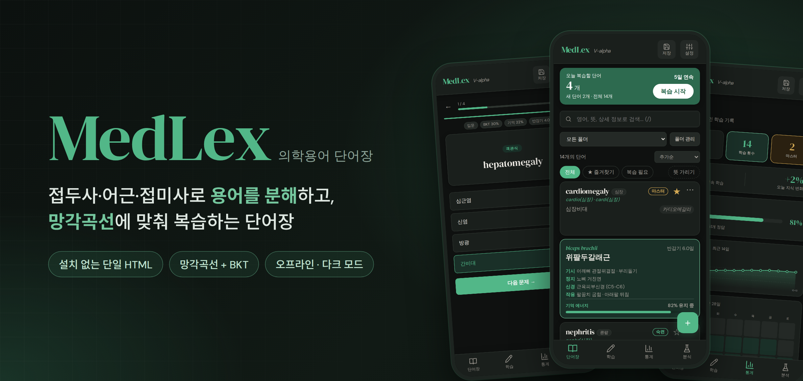
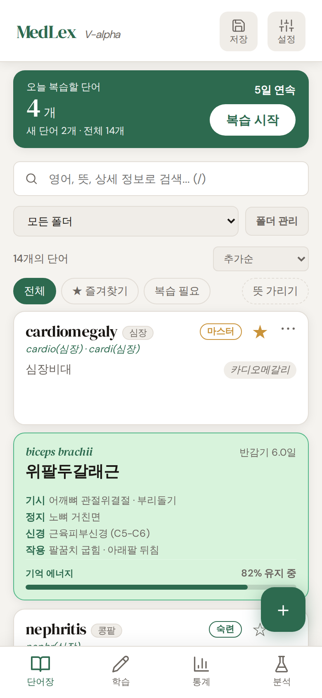
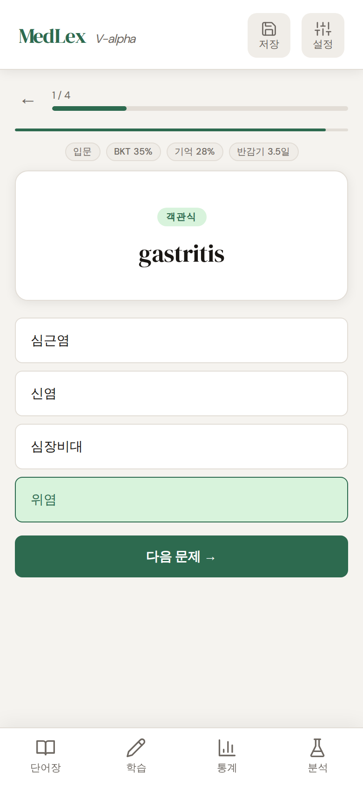
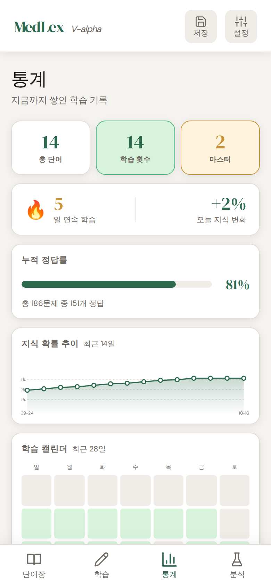
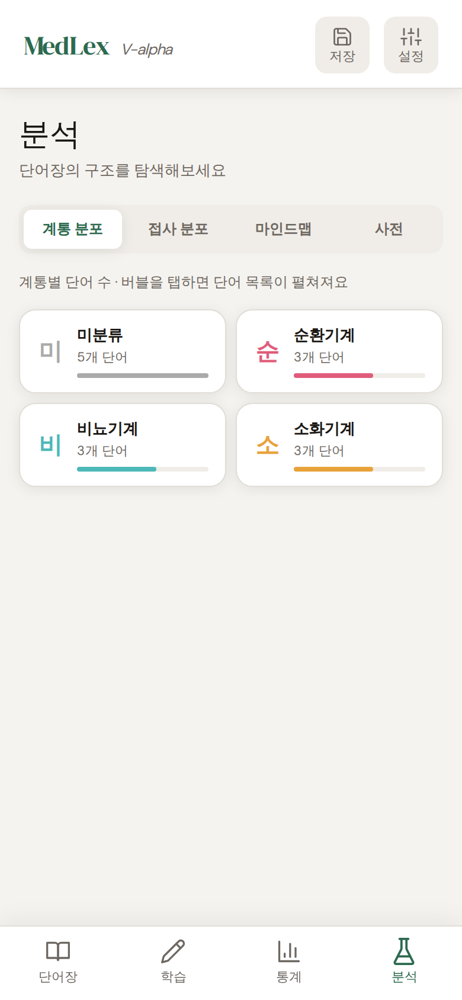
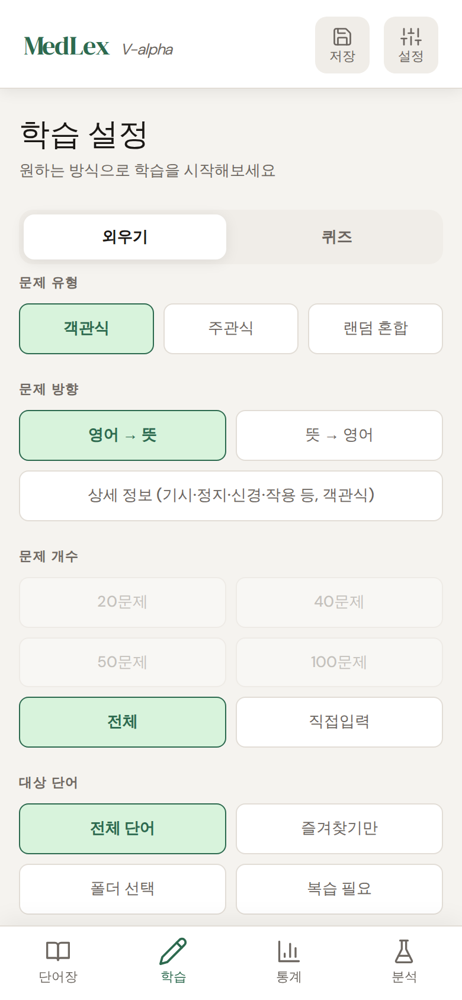
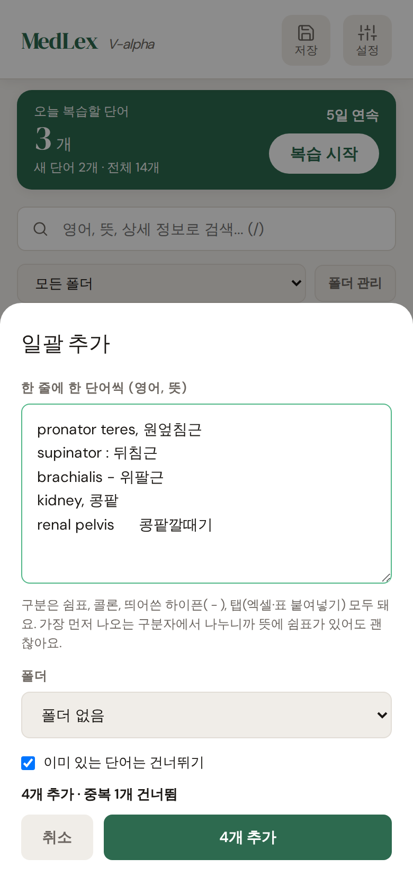

 

**의학 용어의 접두사와 접미사를 체계적으로 색인, 검색, 관리, 학습할 수 있도록 설계된** 
**데이터 분석 및 학습용 단일 파일 웹 애플리케이션입니다.**

 

### [지금 바로 써보기 &rarr;](https://linuse765.github.io/MedLex/)

(2026.04.25 ~ )

 

## 바로 시작하기

별도 설치 없이 아래 링크에서 바로 사용할 수 있습니다.

**https://linuse765.github.io/MedLex/**

1. 우측 하단의 `+` 버튼을 눌러 단어와 뜻을 추가합니다. 여러 개는 추가 창의 **여러 개 한 번에 추가**로 한꺼번에 넣을 수 있습니다.
2. 학습 탭에서 외우기 또는 퀴즈 모드로 학습을 시작합니다.
3. 통계 탭에서 학습 현황과 취약 단어를 확인합니다. (필요시 폴더 기능을 활용하실 수 있습니다)

> `index.html` 파일 하나가 앱의 전부입니다. 내려받아 브라우저로 열어도 똑같이 동작합니다.

 

## 화면 미리보기

브라우저(GitHub) 테마에 맞춰 라이트/다크 화면이 자동으로 바뀝니다.

<table>
  <tr>
    <td align="center" width="33%">
      <picture>
        <source media="(prefers-color-scheme: dark)" srcset="docs/home-dark.png">
        
      </picture>
       <b>단어장</b> 오늘의 복습 · 카드 뒷면에서 기억 에너지 확인
    </td>
    <td align="center" width="33%">
      <picture>
        <source media="(prefers-color-scheme: dark)" srcset="docs/quiz-dark.png">
        
      </picture>
       <b>퀴즈</b> 객관식 · 주관식 · 스마트 출제
    </td>
    <td align="center" width="33%">
      <picture>
        <source media="(prefers-color-scheme: dark)" srcset="docs/stats-dark.png">
        
      </picture>
       <b>통계</b> 연속 학습일 · 정답률 · 지식 추이
    </td>
  </tr>
  <tr>
    <td align="center">
      <picture>
        <source media="(prefers-color-scheme: dark)" srcset="docs/analyze-dark.png">
        
      </picture>
       <b>분석</b> 계통 · 접사 분포 · 마인드맵 · 사전
    </td>
    <td align="center">
      <picture>
        <source media="(prefers-color-scheme: dark)" srcset="docs/study-dark.png">
        
      </picture>
       <b>학습 설정</b> 문제 유형 · 방향 · 대상 단어
    </td>
    <td align="center">
      <picture>
        <source media="(prefers-color-scheme: dark)" srcset="docs/bulk-dark.png">
        
      </picture>
       <b>일괄 추가</b> 붙여넣기만 하면 한 번에 등록
    </td>
  </tr>
</table>

 

## 핵심 기능

### 1. 접사로 용어를 분해해서 이해하기

- 단어를 입력하면 **접두사 · 어근 · 접미사를 자동으로 분해**하고, 조합한 뜻과 어울리는 폴더를 추천합니다.
- **분석 탭**에서 단어장의 구조를 한눈에 봅니다.
  - **계통 분포**: 순환기계, 비뇨기계 등 계통별 단어 수
  - **접사 분포**: 어근 · 접두사 · 접미사별 빈도
  - **마인드맵**: 어근을 중심으로 파생 단어를 펼쳐보기
  - **사전**: 내장 접사 사전을 보고, 직접 접사를 추가
- 검색창은 영어, 한글 뜻, 발음, 상세 정보 어느 쪽으로든 실시간 필터링됩니다.

### 2. 기억 과학에 맞춘 복습

- **망각곡선**: 단어마다 반감기를 추적해 현재 기억 유지율을 계산합니다. (`R = e^(-t/h)`)
- **BKT(Bayesian Knowledge Tracing)**: 맞히고 틀릴 때마다 "이 단어를 알 확률"을 갱신하고, 95% 이상이면 마스터로 봅니다.
- 답한 속도와 정오답에 따라 반감기가 늘거나 줄어듭니다.
- **스마트 출제**: 지금 가장 잊을 것 같은 단어와 처음 보는 단어를 먼저 내고, 마스터한 단어는 뒤로 미룹니다.
- 홈 화면의 **오늘의 복습**에서 복습이 필요한 단어만 바로 퀴즈로 시작할 수 있습니다.

### 3. 학습 방법

- **외우기** 모드(알았다 / 몰랐다)와 **퀴즈** 모드(객관식 · 주관식 · 랜덤 혼합)
- 영어 → 뜻, 뜻 → 영어, **상세 정보** 문제 (기시 · 정지 · 신경 · 작용처럼 직접 정한 항목을 문제로 출제)
- **뜻 가리기**로 스스로 떠올려 본 뒤 카드를 뒤집어 확인
- 퀴즈 도중 나가도 진행 상황이 저장되어 **이어서 풀기** 가능

### 4. 단어 관리

- 폴더, 즐겨찾기, 정렬, 복습 필요 필터
- 단어마다 **상세 정보** 항목을 자유롭게 추가 (근육의 기시/정지/신경/작용 등)
- **일괄 추가**: 한 줄에 한 단어씩 붙여넣기. 쉼표, 콜론, ` - `, 탭 구분을 모두 지원하고 중복은 자동으로 건너뜁니다.
- **삭제 되돌리기**: 실수로 지워도 바로 복원

### 5. 학습 기록

- 연속 학습일, 누적 정답률, 지식 확률 추이 그래프, 28일 학습 캘린더
- 자주 틀리는 **취약 단어** TOP 5

### 6. 데이터는 내 브라우저에

- 단어와 학습 기록은 브라우저(`localStorage`)에 저장되고 서버로 전송되지 않습니다.
- **JSON 내보내기 / 가져오기**로 백업하고 다른 기기로 옮길 수 있습니다.
- 지원하는 브라우저에서는 **파일 연결**로 자동 백업을 쓸 수 있습니다.

 

## 편의 기능

- 다크 모드 / 데스크탑 레이아웃 전환
- 처음 접속하면 기능 투어 안내
- 단축키 (설정에서 원하는 키로 바꿀 수 있습니다)

<b>기본 단축키 보기</b>

 

| 동작 | 키 | 동작 | 키 |
| --- | :---: | --- | :---: |
| 단어 추가 | `N` | 검색창 포커스 | `/` |
| 단어장 / 학습 / 통계 / 분석 탭 | `1` `2` `3` `4` | 즐겨찾기 필터 | `F` |
| 학습 시작 | `Enter` | 설정 열기 | `S` |
| 다음 문제 | `→` | 다크모드 전환 | `D` |
| 정답 제출 (주관식) | `Enter` | 오답 재시험 (결과 화면) | `R` |
| 힌트 보기 (주관식) | `H` | 결과 → 홈 | `Esc` |

 

## 기술 메모

- 의존성과 빌드 과정이 없는 **바닐라 HTML · CSS · JavaScript** 단일 파일입니다.
- 글꼴은 Google Fonts를 사용하며, 오프라인에서는 시스템 글꼴로 대체됩니다.
- 방문 통계를 위한 Google Analytics 스니펫이 포함되어 있습니다. (단어와 학습 데이터는 전송하지 않습니다)

 

## 릴리스

변경 내역은 [Releases](https://github.com/linuse765/MedLex/releases)에서 확인할 수 있습니다.

## 문의 · 피드백

불편한 점이나 건의사항은 [Issues](https://github.com/linuse765/MedLex/issues) 또는 이메일(medlexjw@gmail.com)로 남겨주세요.

## 라이선스

[LICENSE](LICENSE) 파일을 참고해주세요.
